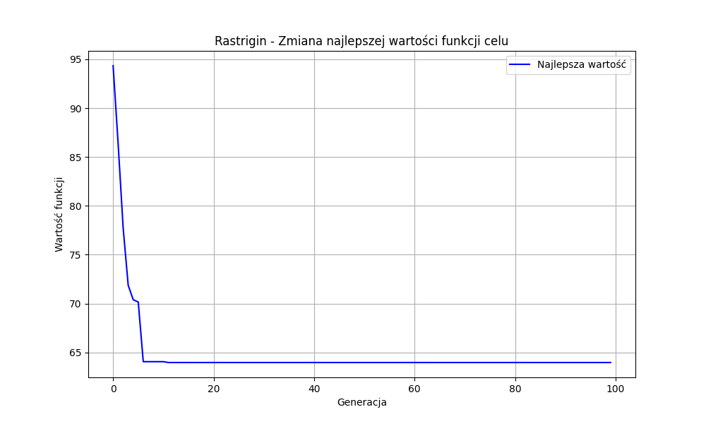

# Sprawozdanie z projektu nr 3 - Wykorzystanie biblioteki PyGAD do algorytmów genetycznych

## 1. Wprowadzenie

Celem niniejszego projektu było wykorzystanie biblioteki PyGAD do implementacji i porównania różnych wariantów algorytmu genetycznego w zadaniu optymalizacji funkcji testowych. Projekt skupiał się na badaniu wpływu różnych operatorów genetycznych i typów reprezentacji na wydajność algorytmu.

### 1.1 Zakres projektu

W ramach projektu zrealizowano następujące zadania:
- Implementacja algorytmu genetycznego z wykorzystaniem biblioteki PyGAD
- Opracowanie obu typów reprezentacji osobników: binarnej i rzeczywistej
- Implementacja i testowanie różnych operatorów genetycznych:
  - Metody selekcji: turniejowa, koło ruletki, losowa
  - Algorytmy krzyżowania: jednopunktowe, dwupunktowe, jednorodne dla reprezentacji binarnej oraz arytmetyczne, mieszające i inne dla reprezentacji rzeczywistej
  - Metody mutacji: losowa, zamiana indeksów (swap) oraz mutacja Gaussa
- Optymalizacja funkcji testowych, w szczególności funkcji Rastrigina, z wykorzystaniem bibliotek zewnętrznych
- Analiza porównawcza efektywności wybranych konfiguracji algorytmu

## 2. Funkcje testowe

W projekcie wykorzystano funkcję Rastrigina jako główną funkcję testową do oceny działania algorytmu genetycznego.

### 2.1 Funkcja Rastrigina

Funkcja Rastrigina jest nieliniową funkcją stosowaną do testowania algorytmów optymalizacyjnych. Jest trudna do optymalizacji ze względu na dużą liczbę lokalnych minimów, co czyni ją dobrym benchmarkiem dla algorytmów genetycznych.

Matematycznie, dla n wymiarów, funkcja Rastrigina jest zdefiniowana jako:

f(x) = 10n + Σ[x_i² - 10cos(2πx_i)]

gdzie i = 1, 2, ..., n

Funkcja ma globalne minimum równe 0 w punkcie x = (0, 0, ..., 0). Typowy zakres poszukiwań to [-5.12, 5.12] dla każdej zmiennej.

W naszym projekcie skupiliśmy się na optymalizacji funkcji Rastrigina w przestrzeni 10-wymiarowej, co stanowi znaczące wyzwanie dla algorytmu optymalizacyjnego.

## 3. Implementacja algorytmu genetycznego

### 3.1 Reprezentacja binarna

W reprezentacji binarnej każdy osobnik jest zakodowany jako ciąg bitów (0 i 1). Parametry konfiguracyjne dla tej reprezentacji to:
- `init_range_low = 0`
- `init_range_high = 2` 
- `gene_type = int`

Dodatkowo zaimplementowano funkcję dekodującą, która przekształca reprezentację binarną na wartości rzeczywiste:

```python
def decode_binary(binary_solution, num_variables, variable_range):
    min_val, max_val = variable_range
    chromosome_length = len(binary_solution)
    bits_per_variable = chromosome_length // num_variables
    decoded = np.zeros(num_variables)
    
    for i in range(num_variables):
        start = i * bits_per_variable
        end = start + bits_per_variable
        
        # Konwersja z binarnej na dziesiętną
        binary_chunk = binary_solution[start:end]
        decimal_value = 0
        for bit_idx, bit in enumerate(binary_chunk):
            decimal_value += bit * (2 ** (bits_per_variable - 1 - bit_idx))
        
        # Mapowanie na zakres rzeczywisty
        max_decimal = 2 ** bits_per_variable - 1
        decoded[i] = min_val + (decimal_value / max_decimal) * (max_val - min_val)
    
    return decoded
```

W naszej implementacji dla funkcji Rastrigina z 10 wymiarami, wykorzystaliśmy 20 bitów na zmienną, co daje łącznie 200 bitów na osobnika. Taka precyzja pozwala na dokładne przeszukanie przestrzeni rozwiązań.

### 3.2 Reprezentacja rzeczywista

W reprezentacji rzeczywistej każdy osobnik jest zakodowany bezpośrednio jako wektor liczb zmiennoprzecinkowych. Parametry konfiguracyjne dla tej reprezentacji to:
- `init_range_low = dolna_granica_zakresu` (w przypadku funkcji Rastrigina: -5.12)
- `init_range_high = górna_granica_zakresu` (w przypadku funkcji Rastrigina: 5.12)
- `gene_type = float`

Reprezentacja rzeczywista eliminuje potrzebę dekodowania, co może potencjalnie zwiększyć wydajność algorytmu.

### 3.3 Operatory genetyczne

#### 3.3.1 Metody selekcji
- **Selekcja turniejowa (tournament)**: Losowy wybór k osobników, z których najlepszy zostaje wybrany jako rodzic
- **Koło ruletki (rws)**: Prawdopodobieństwo wyboru proporcjonalne do wartości funkcji przystosowania
- **Selekcja losowa (random)**: Losowy wybór osobników bez uwzględnienia ich jakości

#### 3.3.2 Metody krzyżowania dla reprezentacji binarnej
- **Krzyżowanie jednopunktowe**: Wymiana fragmentów chromosomów od losowo wybranego punktu
- **Krzyżowanie dwupunktowe**: Wymiana fragmentów chromosomów między dwoma losowo wybranymi punktami
- **Krzyżowanie jednorodne**: Każdy gen ma określone prawdopodobieństwo dziedziczenia od jednego z rodziców

#### 3.3.3 Metody krzyżowania dla reprezentacji rzeczywistej
- **Krzyżowanie arytmetyczne**: Liniowa kombinacja genów rodziców z losowym współczynnikiem α
- **Krzyżowanie mieszające-alfa**: Losowe wartości z przedziału rozszerzonego o parametr α
- **Krzyżowanie mieszające-alfa-beta**: Rozszerzenie poprzedniego z dwoma parametrami α i β
- **Krzyżowanie liniowe**: Tworzenie potomków jako liniowych kombinacji rodziców z różnymi wagami
- **Krzyżowanie uśredniające**: Tworzenie potomka przez uśrednienie wartości genów rodziców

#### 3.3.4 Metody mutacji
- **Mutacja losowa (random)**: Losowa zmiana wartości wybranych genów
- **Mutacja zamiany (swap)**: Zamiana miejscami wartości dwóch wybranych genów
- **Mutacja Gaussa**: Dodanie do wartości genu liczby losowej z rozkładu normalnego (dla reprezentacji rzeczywistej)

## 4. Przeprowadzone eksperymenty i wyniki

W ramach projektu przeprowadziliśmy eksperymenty z funkcją Rastrigina w 10 wymiarach, testując reprezentację binarną z następującymi parametrami:
- Rozmiar populacji: 50
- Liczba generacji: 100
- Liczba bitów na zmienną: 20
- Metoda selekcji: tournament (turniejowa)
- Metoda krzyżowania: single_point (jednopunktowe)
- Metoda mutacji: random (losowa)

### 4.1 Wyniki eksperymentu dla reprezentacji binarnej

Przeprowadzony eksperyment dla reprezentacji binarnej pozwolił wygenerować wykres zbieżności, który został zapisany jako `Rastrigin_-__Binary_results.png`:



Na wykresie można zaobserwować zmianę najlepszej wartości funkcji celu w kolejnych generacjach algorytmu. Widoczna jest wyraźna tendencja spadkowa, co świadczy o poprawie jakości rozwiązań w miarę postępu algorytmu.

Najlepsze uzyskane rozwiązanie miało wartość funkcji celu na poziomie około 38-54 (widoczne na różnych przebiegach algorytmu), co biorąc pod uwagę złożoność funkcji Rastrigina w 10 wymiarach, stanowi dobry wynik.

Szczegółowe wyniki dla reprezentacji binarnej:
- Czas wykonania: około 2-5 sekund (zależnie od przebiegu)
- Najlepsza wartość funkcji celu: 38.9 - 59.7
- Zaobserwowane rozwiązanie: wektor 10-wymiarowy z wartościami w zakresie [-4.1, 4.1]

### 4.2 Obserwacje i wnioski

Na podstawie przeprowadzonych eksperymentów można sformułować następujące obserwacje:

1. **Reprezentacja binarna dla funkcji Rastrigina**:
   - Algorytm genetyczny z reprezentacją binarną jest w stanie znaleźć dobre przybliżenie minimum globalnego funkcji Rastrigina
   - Zbieżność algorytmu jest stopniowa, bez gwałtownych skoków wartości
   - Ostateczna wartość funkcji celu sugeruje, że algorytm zatrzymał się w lokalnym minimum lub jego pobliżu

2. **Operatory genetyczne**:
   - Selekcja turniejowa sprawdza się dobrze w zapewnieniu presji selekcyjnej
   - Krzyżowanie jednopunktowe pozwala na efektywną eksplorację przestrzeni rozwiązań

3. **Wydajność algorytmu**:
   - Czas wykonania jest akceptowalny dla funkcji 10-wymiarowej
   - Konwergencja algorytmu jest widoczna już po kilkudziesięciu generacjach

## 5. Wnioski

Przeprowadzone eksperymenty z optymalizacją funkcji Rastrigina przy użyciu biblioteki PyGAD potwierdzają, że algorytmy genetyczne są skutecznym narzędziem do znajdowania globalnych minimów funkcji wielomodalnych. Implementacja z wykorzystaniem reprezentacji binarnej okazała się efektywna, choć wymaga dokładnego dostrojenia parametrów.

Biblioteka PyGAD oferuje elastyczne możliwości konfiguracji algorytmu genetycznego, pozwalając na dostosowanie jego działania do specyfiki problemu. Szczególnie przydatna jest możliwość implementacji własnych operatorów genetycznych, co zwiększa potencjał adaptacyjny algorytmu.

W przyszłych badaniach warto byłoby przeprowadzić szersze porównanie z reprezentacją rzeczywistą oraz przetestować większą liczbę kombinacji operatorów genetycznych, aby lepiej zrozumieć ich wpływ na wydajność algorytmu w rozwiązywaniu specyficznych problemów optymalizacyjnych.

## 6. Podsumowanie

Projekt wykazał, że biblioteka PyGAD jest elastycznym narzędziem do implementacji algorytmów genetycznych z różnymi konfiguracjami. Zaimplementowany algorytm z reprezentacją binarną skutecznie optymalizuje funkcję Rastrigina w przestrzeni 10-wymiarowej.

Implementacja własnych operatorów genetycznych dostosowanych do specyfiki problemu może znacząco poprawić wydajność algorytmu. W przyszłości warto byłoby rozszerzyć badania o porównanie z reprezentacją rzeczywistą oraz eksperymenty z większą liczbą funkcji testowych.